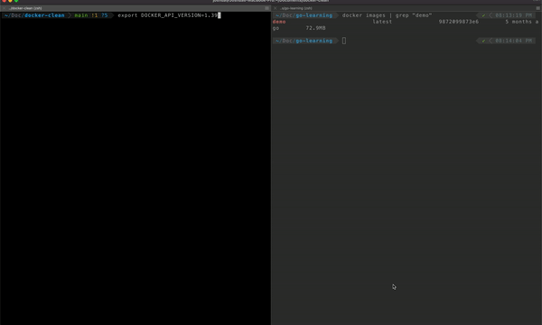

# docker-clean


**Docker-clean** is the CLI app which helps to remove the image from the System using CLI


## Usage

Build the using the below command  or Download it from [here](https://github.com/JOSHUAJEBARAJ/docker-clean/blob/main/docker-clean) 

```
go build .
```

## Demo 




Use **Enter** Key to delete the Docker Image

Note : Since the Docker Client doesn't supports the latest version We have to downgrade the API_Version using by setting the below Environment variable

```
export DOCKER_API_VERSION=1.39
```